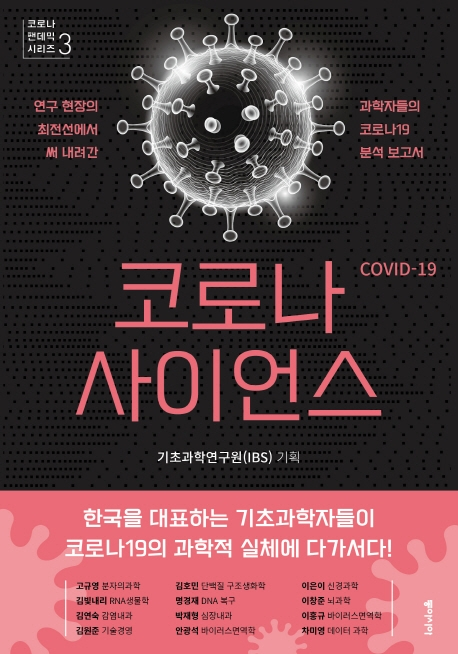

# 도서: [코로나 사이언스](http://www.yes24.com/Product/Goods/93715829)를 읽고 새롭게 알게 된 내용



1부 신종 바이러스의 침투 경로와 방어 전략  
1. 사스코로나바이러스-2는 어떻게 폐렴을 유발하나
2. 바이러스의 구조적 특징과 침투 경로를 차단하는 치료 전략
3. 바이러스로 코로나바이러스를 잡는다: 유전자가위로 바이러스RNA 절단
4. 세포 내 증식 원리에 기반을 둔 치료 전략
5. 인공지능을 통한 진단과 예측
 
2부. 가공할 전파능력, 궁극의 방어 시스템  
1. 코로나19, 왜 슈퍼 전파자가 많을까  
2. 결국은 면역이다<상>: 궁극적 방어시스템, 우리 몸의 면역체계는 어떻게 작동하나  
3. 결국은 면역이다<하>: 젊고 건강한 감염자를 위협하는 '사이토카인 폭풍'  
4. 코로나바이러스는 어떻게 인간에게 옮겨 왔나  
5. 말라리라 치료제로 코로나19 치료: '클로로퀸'은 어떤 작용을 하는가  
6. 코로나19, 에어로졸로 전염될 수 있다

3부. 코로나19에 맞서는 사회  
1. 치료 현장의 의료진 이야기: Into the Unknown, 신종 바이러스와 싸운 100일
2. 'K진단'과 과학자들의 연대
3. 사회적 거리 두기와 '코로나 우울'
4. 팬데믹과 인포데믹
5. 가짜뉴스에 맞선 데이터 과학: 국가별 가짜뉴스 확산과 취약성
6. 코로나19가 가져올 사회경제적 변화: 사회경제적 관점에서 본 확산의 원인
7. 코로나19 정복 가능할까? 여전히 예측하기 어려운 미래


항원(antigen)  
항체(antibody)  


* 코로나19는 에어로졸을 통해 전파될 수 있는가?

최근의 연구 결과는 비말 뿐만 아니라 에어로졸을 통해서도 코로나19 바이러스에 점염될 수 있음을 보여준다. 에어로졸의 크기가 작아질수록 공기 중에서 멀리 이동할 수 있지만, 에어로졸에 포함된 바이러스 입자 수는 그만큼 적어지고 감염성은 점차 떨어진다. 밀폐된 공간에서는 바이러스 농도와 노출 시간이 감염 여부를 결정하는 중요한 요소로 작용한다. 바로 잡아야 생활 습관은 실외에서 마스크를 쓰고 실내에서 마스크를 벗는 행동이다. 실외에서는 공기 중 에어로졸 농도가 빠르게 희석되고 햇빛에 의해 바이러스가 불활성화되기 때문에 감염 가능성이 적지만, 실내에서는 에어컨이나 공조 시스템에 의해 공기가 순환하기 때문에 에어로졸에 의해 집단 감염이 발생할 수 있다. 즉, 실내에서는 거리에 상관없이 마스크를 착용해야 한다.

WHO는 2020-03-09에 "붐비고 환기가 잘 안되는 실내 공간에서 공기 전파의 가능성을 배제할 수 없다"고 밝혔다.

```
비말(droplet): 탄도학상으로 이동하는 대부분 물로 구성된 입자. 분무기의 분무 입자에 비유할 수 있다.  
에어로졸(aerosol): 크기에 상관없이 공기 중에 떠돌아다니는 입자. 초음파 가습기에서 분출되는 엷은 안개에 비유할 수 있다.  
```

* 코로나19는 언제 종식되는가?

과학자의 시각으로 현재의 추이를 본다면 코로나19의 완전한 종식은 현실적으로 어려워 보인다. 주기를 두고 겨울철마다 감기를 일으키는 신종 인플루엔자 바이러스에 인간은 그 나름대로 대응하며 살아왔으나 여전히 완전히 정복하진 못했듯이, 코로나19도 이와 비슷할 것이다. 현재 시점에서는 코로나19의 종식보다는 효율적 예방과 피해 최소화 방안의 도출이 보다 현실적인 고민이라고 할 수 있다. 최상의 시나리오가 실현된다면 우리는 2~3년 내에 펜데믹 이전의 일상을 되찾을 수 있을 것이다. 반면에 최악의 시나리오를 생각해보면 일상 복귀까지 몇 십년이 소요될 수도 있다. 코로나19의 유전자 변이는 다른 바이러스에 비래 매우 빠르다. 유전자 연구자들에 따르면 코로나19는 새로운 숙주에서 살아남기 위해 숙주세포 감염력과 바이러스 증식률이 증가하는 방향으로 유전자 변이가 일어나고 있다고 한다. 이 경우 인류는 코로나19와의 지금 이상으로 길고 힘든 싸움을 준비해야 한다. 

(이 책이 출간된 이후인 2020-12-14에 영국에서 전염력이 70% 더 강한 변종 코로나19 바이러스가 출현했다는 소식이 보고되었고, 곧이어 2020-12-24에 또다른 변종 바이러스가 남아프카공화국으로부터 전파되고 있다는 뉴스가 발표되었다)

* 코로나19는 중국이 만들어낸 생화학 무기인가?

 